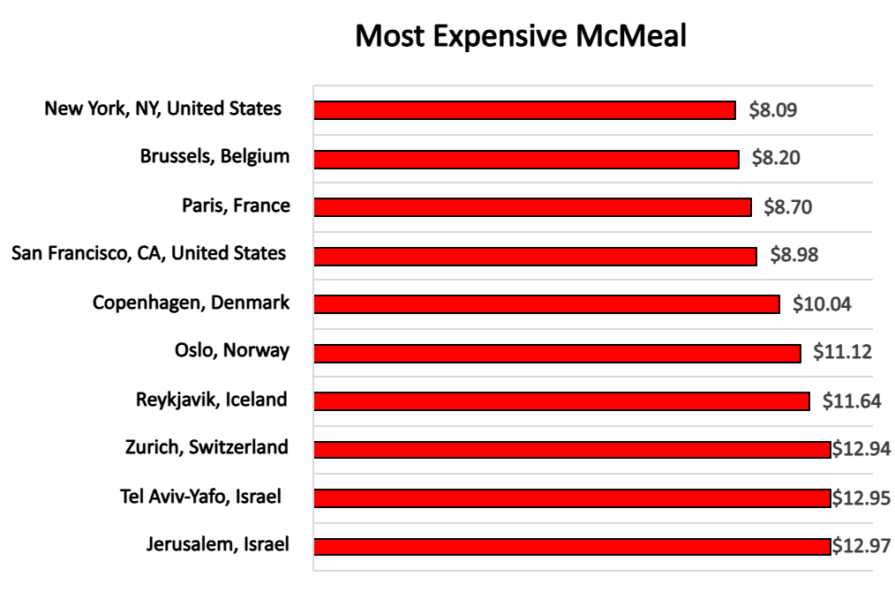
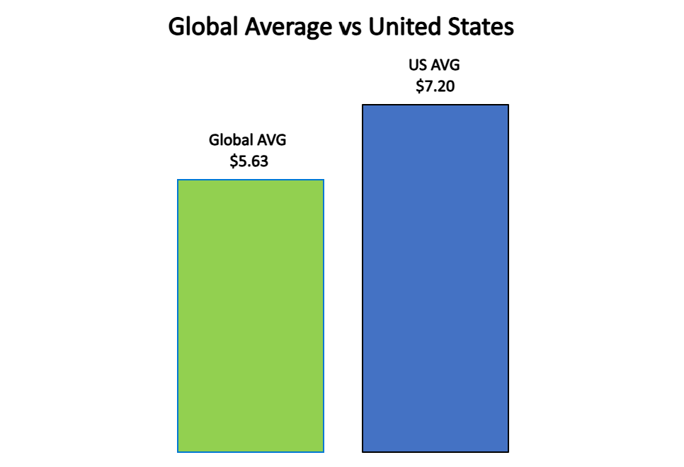
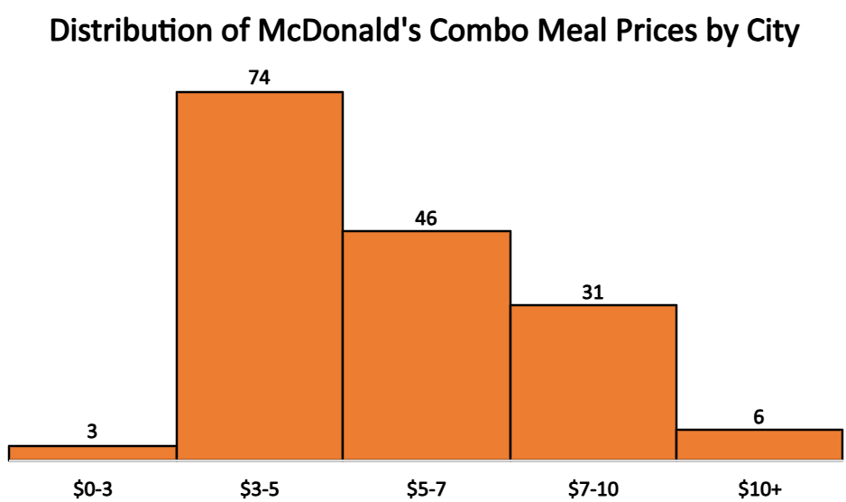

# 🍟 McDonald’s Global Prices (2020)

This project explores the cost of a McDonald’s combo meal ("McMeal") in cities around the world using data from **Numbeo’s 2020 cost-of-living dataset**.

I analyzed over 100 cities globally to visualize global price differences, compare U.S. averages to the rest of the world, and break down affordability across regions.

---

## 📊 Charts & Visuals

### 🔝 Top 10 Most Expensive Cities

### 🇺🇸 U.S. vs Global Average McMeal Price

### 📈 Price Distribution by City

---

All charts were created in **Excel Online**, and exported as clean visuals for clarity and shareability.

---

## 🔍 Key Insights

- San Francisco, Zurich, and Oslo had the **highest combo meal prices** in 2020.
- The **average U.S. price** was around '$7.20', compared to a **global average** of `$5.63`.
- The **cheapest meals** were found in cities like Cairo, Tashkent, and Bangalore.
- Most cities fell into the **$4–$9 price range**, showing wide affordability globally *pre-pandemic*.

---

## 📁 Data Source

> [Numbeo – Cost of Living Dataset (2020)](https://www.kaggle.com/code/joeypp/cost-of-living-numbeo-dataset)

This dataset includes crowd-sourced itemized prices from several cities, including fast-food items like combo meals, drinks, and groceries.

---

## 🧰 Tools Used

- **Excel Online** – data cleaning, filtering, and visualization
- **Google Sheets** – optional price analysis
- *(Future enhancement: Python for deeper data analysis + interactivity)*

---

## 📦 Project Purpose

This project was built to:
- Practice real-world data analysis using a relatable topic (fast food 🍔)
- Visualize international price disparities
- Create a **portfolio-ready** dataset project for GitHub and LinkedIn

---

## 📬 Contact

**Nelson Ayoola**  
💼 [LinkedIn](https://www.linkedin.com/in/nelson-a-83008a251/)  
🛠️ Data analyst open to freelance and collaborative projects  
✉️ Feel free to reach out for ideas, feedback, or comments.
